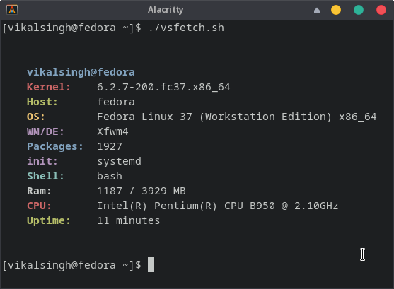

<div align="center">
<h2> vsfetch 💞️</h2>

<p>⚡ vsfetch is a minimal system info program written in shell.
</p>
<br>

</div>
- 🔭Clone this repository & run vsfetch.
- 😊enjoy your minimal system info program
  
  
  
```yaml
# clones the vsfetch repo
$ git clone https://github.com/almighty20/vsfetch
# cd in vsfetch
$ cd vsfetch
# give permession to vsfetch to run 
  
$ sudo chmod +x vsfetch
# press enter after this command 
#now run vsfetch
#execute this command to run vs fetch.
$ ./vsfetch
```
