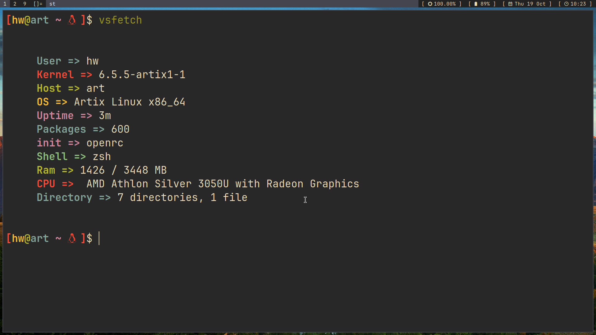
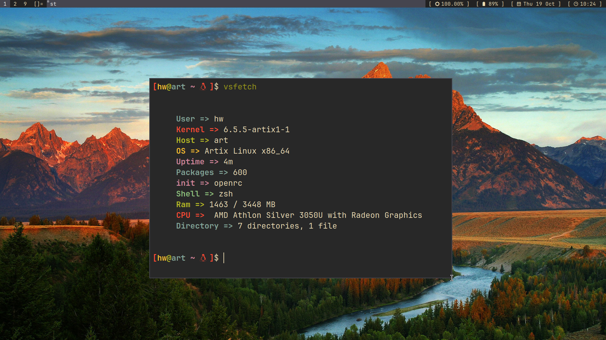

<div align="center">
  
<h1> vsfetch</h1>
</div>
<p>⚡ vsfetch is a minimal system info program written in shell.
</p>


<br>
<br>


<div align="center">


<h2>Linux</h2>



<br>

<br>

<br>

<h2>WSL2 (Windows Subsystem for Linux)</h2>


<br>
</div>
<br>

## About

Custom system information fetching tool written in bash.

## Requirements
- No requirements, we made this script because other tools were having this issue of dependencies.

## Run with curl

If you don't wanna clone this repo or install vsfetch, you can use curl.

```yaml
$ curl https://raw.githubusercontent.com/vikvss/vsfetch/main/vsfetch | bash
```

## Installation
### Manual:
- 🔭Clone this repository & run vsfetch
- 😊enjoy your minimal system information fetcher
  
  
  
```yaml

# clones the vsfetch repo
$ git clone https://github.com/vikvss/vsfetch
# cd in vsfetch
$ cd vsfetch
# give permession to vsfetch to run 
  
$ sudo chmod +x vsfetch
# press enter after this command 
#now run vsfetch
#execute this command to run vs fetch.
$ ./vsfetch
```


> You can also run directly

```yaml
$ wget https://raw.githubusercontent.com/vikvss/vsfetch/main/vsfetch && chmod +x vsfetch
```

- You can also add vsfetch to PATH by placing it in `/usr/local/bin`

```yaml
$ sudo cp vsfetch /usr/local/bin
```

### If you want to contribute, create pull request.
